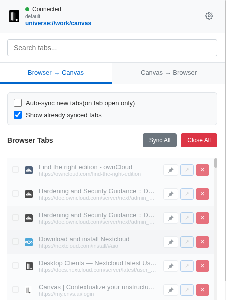
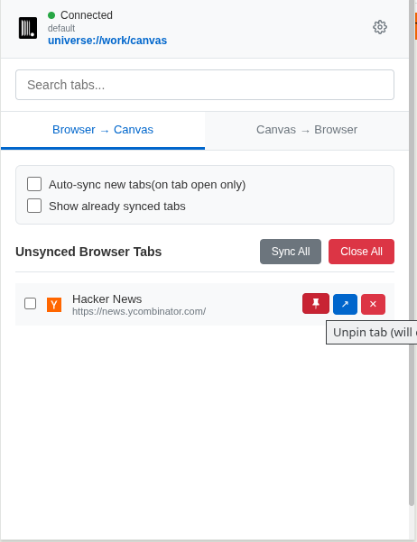
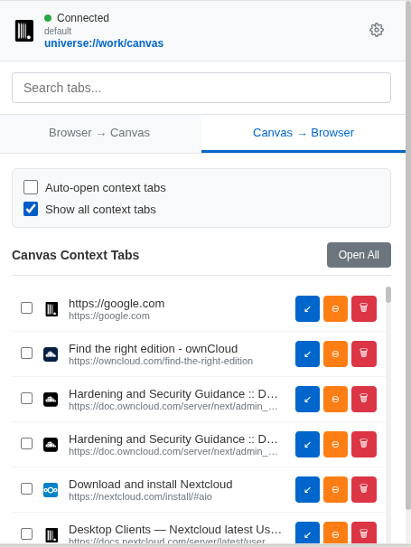
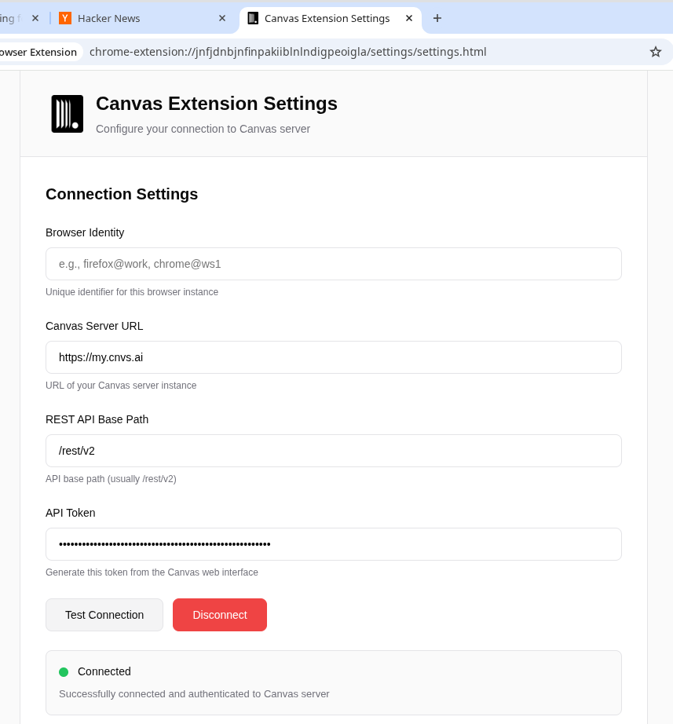

# Canvas Browser Extension

A browser extension for seamlessly syncing browser tabs with Canvas server contexts. Extension allows you to connect several users / browsers / applications to a single shared context and working with tabs collaboratively.

## Screenshots

### Extension Popup







### Extension Settings



## Installation

### Method 1: Browser Store Installation (Recommended)

🚀 **Canvas Browser Extension is now available on official browser stores:**

| Browser | Store Link |
|---------|------------|
| **Chrome/Chromium** | [Chrome Web Store](https://chromewebstore.google.com/detail/nddefgjgkhcpmgpipifjacmoinoncdgl) |
| **Firefox** | [Firefox Add-ons](https://addons.mozilla.org/en-US/firefox/addon/canvas-browser-extension) |

**Benefits of store installation:**
- ✅ **Automatic updates** - always have the latest version
- ✅ **Simplified installation** - one-click install
- ✅ **Verified security** - reviewed by browser vendors
- ✅ **Easy management** - manage through browser extension settings

### Method 2: Download Release Package

**For users who prefer manual installation or need specific versions:**

Download the latest release for your browser:

| Browser | Download |
|---------|----------|
| **Chromium-based** (Chrome, Edge, Brave, Opera) | [📦 canvas-extension-chromium.zip](https://github.com/canvas-ai/canvas-server/releases/latest) |
| **Firefox** | [📦 canvas-extension-firefox.zip](https://github.com/canvas-ai/canvas-server/releases/latest) |

**Installation steps:**

**Chromium browsers (Chrome, Edge, Brave, etc.):**
1. Download the Chromium package
2. Extract the ZIP file
3. Open `chrome://extensions/`
4. Enable "Developer mode"
5. Click "Load unpacked"
6. Select the extracted folder

**Firefox:**
1. Download the Firefox package
2. Extract the ZIP file
3. Open `about:debugging`
4. Click "This Firefox"
5. Click "Load Temporary Add-on"
6. Select the `manifest.json` file from the extracted folder

### Method 3: Development Installation

For developers and testing:

1. **Install dependencies** (from browser extension directory):
   ```bash
   cd src/ui/browser-extension
   npm install
   ```

2. **Build the extension**:
   ```bash
   # Development build (unminified, with console logs)
   npm run build:dev
   
   # Production build (minified, optimized)
   npm run build
   ```

3. **Load in browser** (same steps as Method 2, but use `packages/chromium/` or `packages/firefox/` directories)

## Setup

1. **Install and run Canvas server** or **create an account via https://getcanvas.org**

2. **Open Canvas web interface and generate an API token**

3. **Configure extension**

## Sync Behaviors

Configure in Settings page:

- **Auto-sync new tabs**: Automatically save new browser tabs to Canvas
- **Auto-open context tabs**: Automatically open new context tabs in browser
- **Auto-close removed tabs**: Close browser tabs when removed from context
- **Browser-specific sync**: Only sync tabs from this browser instance
- **Context change behavior**: What to do when switching contexts

## Releases and Distribution

Canvas Browser Extension uses automated GitHub Actions to build and distribute cross-platform packages. Every time a version tag is pushed, the system automatically:

- 🏗️ **Builds packages** for Chromium and Firefox browsers
- 🧪 **Tests all packages** to ensure they work correctly
- 📦 **Creates release packages** with proper naming and compression
- 🔐 **Generates checksums** for security verification
- 🚀 **Publishes to GitHub Releases** with comprehensive release notes

### Verifying Downloads

For security, always verify your downloads using the provided checksums:

```bash
# Download checksums.txt from the release page
sha256sum -c checksums.txt
```

### Release History

See the [GitHub Releases page](https://github.com/canvas-ai/canvas-server/releases) for complete release history, changelogs, and older versions.

## Security

- **API tokens** stored securely via browser storage APIs
- **Strict Content Security Policy** prevents code injection
- **Input validation** and sanitization on all user inputs
- **HTTPS-only communication** in production environments
- **Manifest V3 compliance** for modern security standards
- **Minimal permissions** - only requests necessary browser permissions

## Browser Compatibility

- **Chrome**: v88+
- **Edge**: v88+
- **Firefox**: v109+
- **Brave**: v1.20+
- **Opera**: v74+

## License

Licensed under AGPL-3.0-or-later. See main project LICENSE file. 
